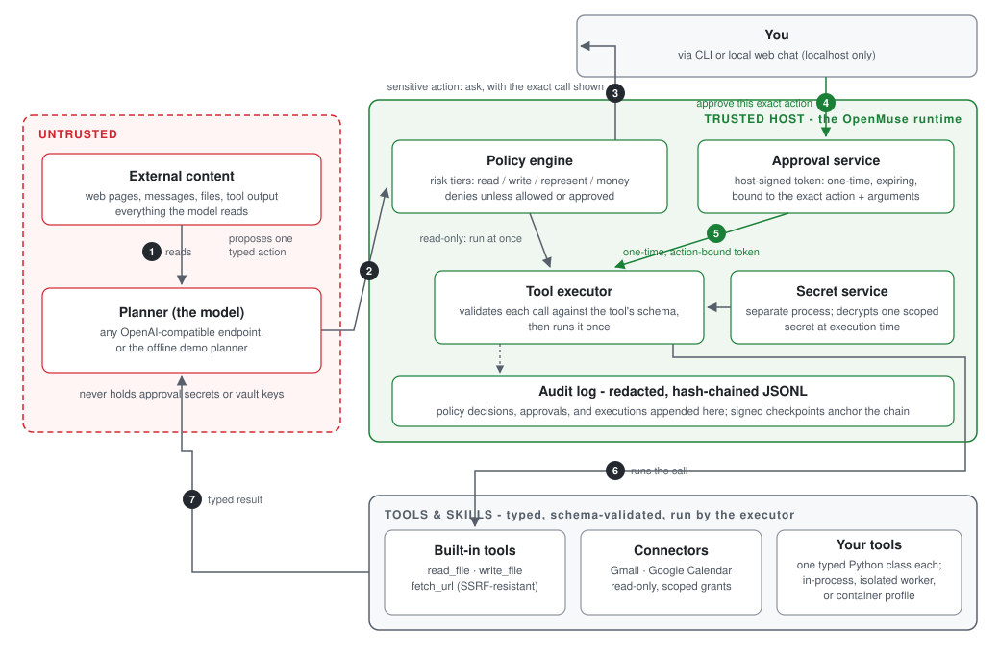
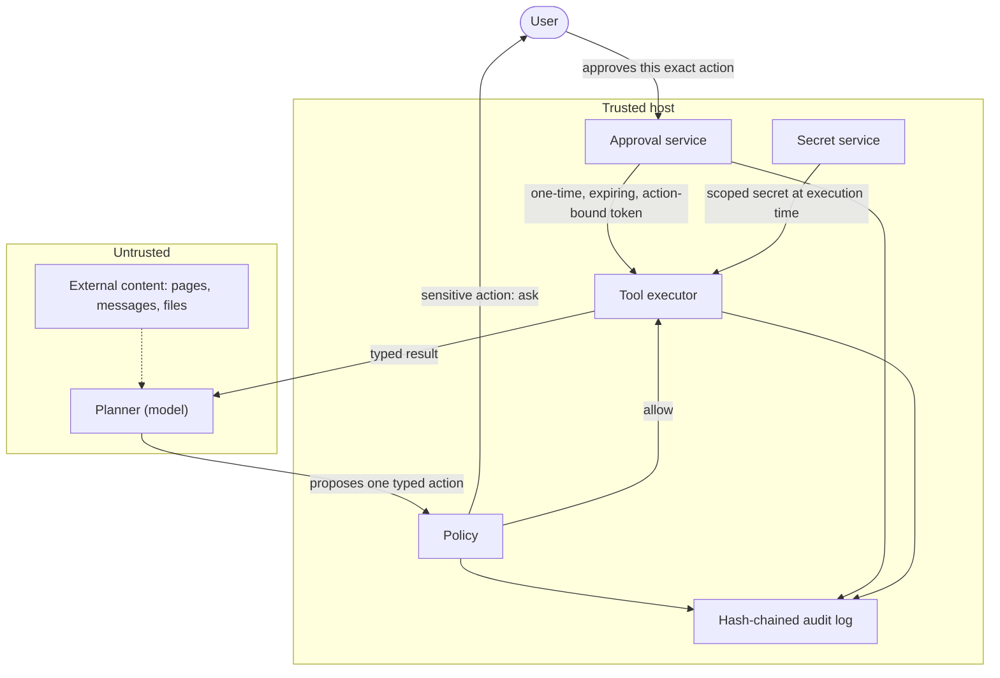

<p align="center">
  
</p>

<h1 align="center">OpenMuse</h1>

<p align="center">
  A local-first personal-agent runtime you can inspect and extend, with exact-action approvals and verifiable audit.<br>
  Build on typed tools, isolated workers, and encrypted secrets without giving the planner unchecked access.
</p>

<p align="center">
  <a href="https://github.com/tahodev/openmuse/actions/workflows/ci.yml"></a>
  <a href="LICENSE"></a>
</p>

## Architecture at a glance

<p align="center">
  
</p>

The model proposes; the host decides. Every sensitive call pauses for your exact-action approval, and every decision lands in the hash-chained audit log. Full boundary in [docs/architecture.md](docs/architecture.md).

## Why OpenMuse is different

Use OpenMuse when you want to build a personal agent and inspect the host that decides what it may do. It is a Python runtime with a local browser chat and tested approval and audit boundaries, not a hosted assistant or a multi-agent orchestration suite. Compared with rolling your own, the permission checks and audit path are already here to read, run, and extend:

- **Exact-action approval.** The host signs each approval token for one tool call and its exact arguments. Tokens expire, can be consumed once, and cannot be minted by the planner.
- **Verifiable audit.** Decisions land in a redacted, hash-chained local log. Signed checkpoints can be published to an independent store so later verification can detect rewritten history.
- **Secrets stay outside planner context.** A process-separated service decrypts secrets for the host at execution time. Secret values do not enter action arguments, tool manifests, or the audit log.
- **Bounded execution.** Typed schemas, budgets, SSRF-resistant fetches, resource-limited workers, and a network-isolated container profile constrain what a proposed action can do.


## How OpenMuse compares

Checked against each project's current docs and repositories (September 2026).

| | OpenMuse | [OpenClaw](https://github.com/openclaw/openclaw) | [CrewAI](https://github.com/crewAIInc/crewAI) | Roll your own |
|---|---|---|---|---|
| What it is | A small local-first personal-agent runtime you can read end to end (Python, alpha) | A full personal-assistant platform: gateway, channels, apps, skill registry | A multi-agent orchestration framework (Python) | Your own stack, your own rules |
| Local-first | ✅ Runs on your machine, localhost-only chat, no hosted service | ✅ State, memory, and credentials live on your hardware; gateway binds to loopback by default | ⚠️ The framework runs locally (local models included); observability and the control plane live in the commercial AMP suite | ✅ If you build it that way |
| Exact-action approvals | ✅ Every sensitive tool call needs a host-signed token bound to that exact action and its arguments: one-time, expiring, and impossible for the planner to mint | ⚠️ Host-command approvals bind exact argv, cwd, and executable, but other tools run under allowlists and single-operator installs default to `security=full` (no prompting) | ❌ `human_input=True` asks a human to review a task's final answer, not each tool call | You build it |
| Verifiable audit log | ✅ Redacted, hash-chained JSONL with signed checkpoints and a verifier you can run | ❌ A metadata-only activity ledger with 30-day retention; the community PR that added a tamper-evident chain was declined | ❌ Tracing via AMP or third-party observability tools; no tamper-evident audit trail | You build it |
| Hackability | ✅ Typed tools, an extension cookbook, and a core small enough to read in an afternoon | ✅ TypeScript plugin SDK plus the ClawHub skill registry | ✅ Large integration ecosystem, YAML/Python crew definitions | ✅ Total, including the security bugs |

Sources: OpenClaw [security](https://docs.openclaw.ai/gateway/security), [exec approvals](https://docs.openclaw.ai/tools/exec-approvals), [audit history](https://docs.openclaw.ai/gateway/audit), and the [declined audit-chain PR #23835](https://github.com/openclaw/openclaw/pull/23835); CrewAI [README](https://github.com/crewAIInc/crewAI) and [human input docs](https://docs.crewai.com/en/learn/human-input-on-execution).

## See the safety boundary in 30 seconds

The demo starts a task, pauses before a write, approves that exact action, runs it, and verifies the resulting audit chain.

[](https://asciinema.org/a/MYdPbeccAUeoC8uy)

This is a real terminal capture. Its raw, replayable cast is [checked into the repository](docs/assets/openmuse-demo.cast).

## Run it locally

Requires Python 3.11+ and Git. Run these commands in a terminal from a clean checkout. The deterministic demo needs no API key or live account. On Windows, use the activation command in the comment instead of `source`.

```bash
git clone https://github.com/tahodev/openmuse.git
cd openmuse
python -m venv .venv
source .venv/bin/activate             # Windows: .venv\Scripts\activate
python -m pip install -e '.[dev]'
python examples/e2e_demo.py
```

At `Approve this exact action? [y/N]`, inspect the displayed tool, path and content, then type `y` to let the demo write its sample plan. It writes only inside `.openmuse-demo/` (and replaces that demo folder on each run), not to an external service. Then verify the audit chain:

```bash
python examples/verify_audit.py
```

Expected result:

```text
VERIFIED: 3 records form an intact hash chain
```

You should also see `VERIFIED: approved action == executed action (...)`. If you answer `N`, nothing is written and there is no completed action to verify. Change any audited byte and verification fails. More credential-free paths are indexed in [`examples/`](examples/README.md).

## Chat in your browser

After the install above, start a local web chat in another terminal from the repo root:

```bash
openmuse-chat --workspace .
```

Open http://127.0.0.1:8766 in your own browser. Without an API key it uses an offline demo planner, so you can try `read README.md`, then `write notes/hello.txt: hi` to see an approval card. The chat uses the directory passed to `--workspace` (here the repo root), so use a throwaway checkout for experiments. Stop the server with Ctrl+C. Export `OPENAI_API_KEY` (or pass `--planner openai --model ... --base-url ...` for any OpenAI-compatible endpoint) to chat with a real model.

Reads run immediately. Writes go through the same approval boundary as the CLI: the chat pauses, shows a host-rendered card with the exact tool, destination, and arguments, and runs the action once only after you click **Approve exact action**. Denied actions never run, a decision cannot be replayed, and planner output can never carry its own approval. Every step lands in `.openmuse/web-chat-audit.jsonl`.

The server binds to localhost only and is a reference app, not a hosted service.

## The approval boundary

The planner and everything it reads are untrusted. Only the host can issue an approval, and that approval is bound to one exact action:



`Channel -> durable Task -> Planner -> typed Action -> Policy/Approval -> Tool -> typed Result`

See the [architecture](docs/architecture.md), [threat model](docs/threat-model.md), and [product foundation](docs/product-foundation.md) for the full boundary.

## Use a real model

`OpenAICompatiblePlanner` supports OpenAI-compatible chat-completions endpoints. Use a test key and non-sensitive data while OpenMuse is alpha.

```python
import os
from pathlib import Path

from openmuse.core import Agent
from openmuse.policy import Policy
from openmuse.providers import OpenAICompatiblePlanner
from openmuse.tools import ReadFile

agent = Agent([ReadFile(Path.cwd())], Policy(), Path(".openmuse/audit.jsonl"))
planner = OpenAICompatiblePlanner(api_key=os.environ["OPENAI_API_KEY"])
print(agent.run("Read README.md and stop", planner))
```

The deterministic demo remains the recommended first run because it is free and reproducible.

## Project status

OpenMuse is an **alpha security-primitives runtime and reproducible demo**, not a production personal assistant. “Working” means implemented and covered by the current test suite, not independently audited or safe for unattended sensitive accounts.

| Area | Working now | Remaining production gate |
|---|---|---|
| Safety | Exact-action approvals, persistent single-use decisions, schema validation, SSRF-resistant fetch, redacted hash-chained audit, signed checkpoints | Publish checkpoints to an independent append-only store; complete independent security review |
| Runtime | Budgeted planner loop, durable tasks, timezone-aware atomic cron claims, narrowing subagents, resource-limited process worker, CI-validated locked-down container profile | Validate the chosen container or VM runtime in deployment; provide a production approval UI |
| Data and secrets | Verifiable memory, encrypted vault, OS-keyring master key, process-separated authenticated secret service | Add a hardware-backed master-key provider and deployment-specific key operations |
| Connectors | Credential-free simulations, read-only Gmail and Google Calendar, managed OAuth with revocation | Independently deploy the OAuth callback and add reviewed providers |
| Channels | Local web chat with in-browser exact-action approvals, in-process web adapter, and browser-worker policy envelope | Add authenticated hosted routes and validate isolated browser deployment |

Do not use OpenMuse with sensitive production accounts yet. Deployment guidance and open gates live in the [roadmap](docs/roadmap.md), [container profile](docs/container-worker.md), [audit anchoring guide](docs/audit-anchoring.md), [approval service guide](docs/approval-service.md), and [secret service guide](docs/secret-service.md).

The Python distribution is named `openmuse-agent`. Unlike [Digger's deployable OpenMuse assistant](https://github.com/diggerhq/openmuse), this project focuses on host-enforced approval, bounded execution, and verifiable local audit trails.

> Independent project. Not affiliated with or endorsed by Meta. No Meta code, branding, or assets are used.

## Contributing

See the [extension cookbook](docs/extension-cookbook.md), [public API policy](docs/public-api.md), [scheduling semantics](docs/scheduling.md), [CONTRIBUTING.md](CONTRIBUTING.md), [governance](GOVERNANCE.md), and [code of conduct](CODE_OF_CONDUCT.md). Starter work is tracked with [`good first issue`](https://github.com/tahodev/openmuse/labels/good%20first%20issue) and [`help wanted`](https://github.com/tahodev/openmuse/labels/help%20wanted) labels.

## License

MIT.

